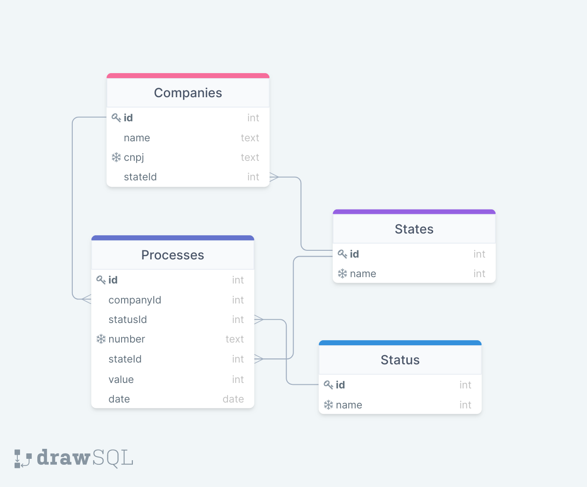

# Teste Técnico - Número 03 - Sistema de Gerenciamento de Processos

Esta API também está disponível em https://sistema-de-gerenciamento.herokuapp.com/

Este é o banco de dados:



OBS: o arquivo .env não foi ignorado dos commits para que a variável de ambiente com a URL do bando de dados do deploy já esteja correta, e seja possível todas as verificações locais sem ter que criar outro banco de dados.

## Como rodar o projeto

1. Clone este repositório
2. Instale as dependências
```bash
npm i
```
3. Rode o servidor localmente
```bash
npm run dev
```
4. Para conferir os testes, execute
```bash
npm t
```

## Teste 01

Rota: /processes/status?name=ativo

Nesta rota é possível filtrar pelo status do processo (inativo ou ativo).

## Teste 02

Rota: /processes/average?company=Empresa-A&state=rj

Nesta rota é possível filtrar os processos por empresas (Empresa-A ou Empresa-B) e estado (RJ, SP, MG ou AM).

## Teste 03

Rota: /processes/value?greaterThan=100000

Nesta rota é possível filtrar pelo valor do processo, retornando os que possuirem valor superior ao informado, em R$.

## Teste 04

Rota: /processes

Nesta rota todos os processos são listados, incluindo o estado de origem do mesmo e também o estado da empresa.
Por isso, no teste, existe um filtro que define o mês a ser considerado para o sucesso do mesmo.

## Teste 05

Rota: /processes

Nesta rota todos os processos são listados, incluindo o estado de origem do mesmo e também o estado da empresa.
Sendo assim, no teste existe a filtragem e verificação para relacionar o estado da empresa com o estado de origem do processo, e retornar os processos que são do mesmo estado da empresa.

## Teste 06

Rota: /processes/number?number=trab

Nesta rota é possível filtrar por qualquer string contendo parte do número do processo.

## Tecnologias utilizadas

<div align="start" style="margin: auto" >

  <a href="https://www.linkedin.com/in/renato-salgado-dias/">
    
  </a>
  
  <a href="https://www.linkedin.com/in/renato-salgado-dias/">
    
  </a>
  
  <a href="https://www.linkedin.com/in/renato-salgado-dias/" target="_blank">
    
  </a>  
  
   <a href="https://www.linkedin.com/in/renato-salgado-dias/">
    
  </a>
  
  <a href="https://www.linkedin.com/in/renato-salgado-dias/" target="_blank">
    
  </a>
  
  <a href="https://www.linkedin.com/in/renato-salgado-dias/">
    
  </a> 
  
  <a href="https://www.linkedin.com/in/renato-salgado-dias/">
    
  </a> 
  
  <a href="https://www.linkedin.com/in/renato-salgado-dias/">
    
  </a> 
  
  <a href="https://www.linkedin.com/in/renato-salgado-dias/">
    
  </a> 

</div>
